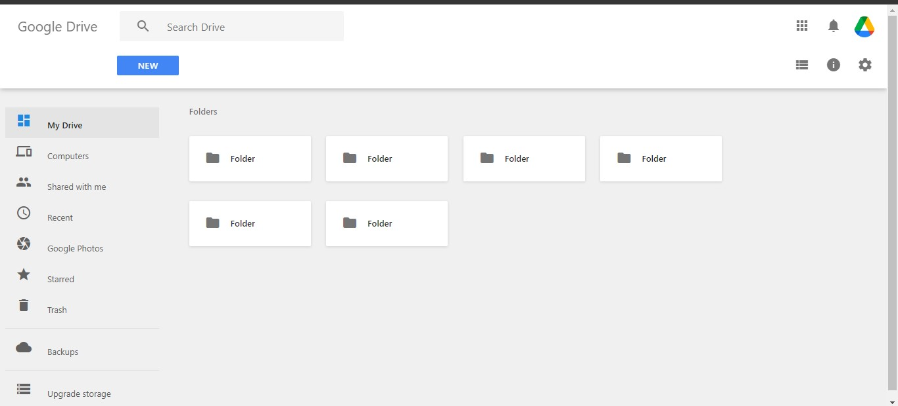

## Google-Drive-Clone
This is just a clone of google drive made using  and  which i learnt in a web development bootcamp organised by DevTown.

## Deployment

Run this code in VS Code with a properly configured Live Server Extension.

## RESULTS:

## Author

- [gshaksham](https://github.com/gshaksham)

## Feedback

If you have any feedback, please reach out to me at @guptashaksham94@gmail.com

